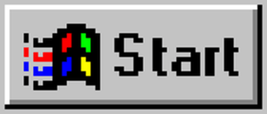

<p align="center">
  
  
  
  
  
</p>

<h1 align="center">
  <br>
  
  <br>
  Fabian's Windows 95 Portfolio
  <br>
</h1>

<h3 align="center">
  A fully interactive Windows 95 desktop environment built from scratch with React, TypeScript, and the React95 component library. Complete with a real boot sequence, 11 desktop applications, Clippy, DOOM, and authentic sound effects.
</h3>

<p align="center">
  <a href="https://veliceafabianpavel.github.io/portfolio/">
    
  </a>
</p>

---

## Table of Contents

- [Overview](#overview)
- [Boot Sequence](#-boot-sequence)
- [The Desktop](#-the-desktop)
- [Desktop Applications](#-desktop-applications)
- [Clippy Assistant](#-clippy-assistant)
- [Easter Eggs](#-easter-eggs)
- [Sound Scheme](#-sound-scheme)
- [Error Handling](#-error-handling)
- [Tech Stack](#-tech-stack)
- [Project Structure](#-project-structure)
- [Getting Started](#-getting-started)
- [Deployment](#-deployment)
- [Credits & Acknowledgments](#-credits--acknowledgments)
- [Author](#-author)

---

## Overview

This is not your average portfolio website. Instead of a typical single-page layout, this project recreates the entire **Windows 95 operating system** experience in the browser — from the moment you "power on" and see the BIOS screen, through the DOS boot and Windows loading animation, all the way to a fully functional desktop with draggable icons, resizable windows, a Start menu, a taskbar, and a system tray.

Every detail is crafted to match the authentic Windows 95 experience: the pixelated cursors, the system sounds, the 3D-beveled window borders, the modal dialog boxes, and yes — even **Clippy**.

### Key Highlights

- **Full boot sequence** — BIOS POST, DOS boot, Windows 95 loading bar, password prompt
- **11 interactive desktop apps** — each one a real, functional application
- **Clippy assistant** — context-aware, interactive, with a secret menu
- **DOOM (1993)** — playable directly in the browser via WebAssembly
- **Authentic Win95 sounds** — startup chime, error beeps, and warning sounds
- **Draggable desktop icons** with persistent positions (localStorage)
- **Changeable wallpapers** via Display Properties
- **Mobile detection** with a Blue Screen of Death (because Win95 didn't run on phones)
- **Keyboard shortcuts** — F1 through F9 for apps, Ctrl+Z for undo, and more

---

##  Boot Sequence

The portfolio faithfully recreates the Windows 95 startup experience in five stages:

| Stage | Screen | What Happens |
|-------|--------|-------------|
| 1 | **BIOS POST** | Simulated Phoenix BIOS with memory count, Pentium 75 MHz CPU detection, and drive enumeration |
| 2 | **DOS Boot** | `CONFIG.SYS`, `AUTOEXEC.BAT`, `HIMEM.SYS` loading — typewriter-style text output |
| 3 | **Loading Screen** | The classic Windows 95 flag with animated progress bar |
| 4 | **Welcome / Login** | Password prompt (any password works — just like real Win95). Plays the **Brian Eno startup sound**. Wrong password triggers a Win95-style error dialog with `chord.wav` |
| 5 | **Desktop** | Full Windows 95 desktop with taskbar, Start menu, system tray with clock |

> On mobile devices, the boot sequence short-circuits into a **Blue Screen of Death** — because Windows 95 doesn't belong on a phone.

---

##  The Desktop

The desktop is the heart of the portfolio and includes:

- **Draggable icons** — arranged in a grid, positions saved to `localStorage`
- **Resizable, draggable windows** — with minimize, maximize, and close buttons
- **Taskbar** — shows all open windows, Start button, and system tray clock
- **Start Menu** — with Programs, Settings, and Shut Down options
- **Right-click context menu** — on desktop background
- **Window Z-ordering** — click a window to bring it to front
- **Keyboard shortcuts** — F1-F9 open apps, F3 resets icon positions
- **Win95 cursors** — authentic base64-encoded bitmap cursors for pointer, hand, and text

---

##  Desktop Applications

### About Me — `System Properties`
A tabbed dialog (General / Experience / Education / Publications / Links) showing personal information, work history at Siemens, education details, published papers, and external links. Styled like the classic Windows `sysdm.cpl` dialog.

### Projects — `Windows Explorer`
A Windows Explorer-style file browser showcasing projects. The main project is **PeP5** — a programming examination platform with AI grading, SafeExamBrowser-level security, and multi-language support. Click a project folder to see features, architecture, security measures, and supported languages.

### Skills — `Device Manager`
Displays technical skills organized by category (.NET Ecosystem, Web & Frontend, Backend & Systems, DevOps & Tools) with **animated progress bars** showing proficiency levels. Click category headers to expand/collapse. Skills include .NET C# (95%), Git (90%), Blazor (90%), SQL (88%), and more.

### Contact — `Outlook Express`
An email composition form styled like Outlook Express. Fill in your name, email, subject, and message — hitting Send opens your default mail client with everything pre-filled via `mailto:` link. Plays `ding.wav` on success.

### Notepad — `notepad.exe`
A plain-text viewer displaying Fabian's full resume. Styled exactly like the original Notepad with the classic menu bar (File, Edit, Format, Help) and monospace font.

### Internet Explorer — `iexplore.exe`
A mock browser with an address bar, navigation buttons, and a home page featuring Fabian's links. Type URLs in the address bar to browse (opens in an iframe). Includes favorites with shortcuts to GitHub and project links.

### Minesweeper — `winmine.exe`
A fully playable Minesweeper implementation with:
- Classic 9x9 grid with 10 mines
- Left-click to reveal, right-click to flag
- Mine counter and timer
- Win/lose detection with `ding.wav` / `chord.wav` sound effects
- Smiley face reset button

### MS-DOS Prompt — `command.com`
An interactive DOS terminal emulator supporting real commands:
- `HELP` — lists available commands
- `DIR` — shows directory listing
- `VER` — displays version info
- `CLS` — clears the screen
- `WIN` — "starts" Windows 95
- `DOOM` — launches DOOM
- And more (`CD`, `TYPE`, `DATE`, `TIME`, `COLOR`, `ECHO`)

### Calculator — `calc.exe`
A fully functional calculator with:
- Standard arithmetic operations (+, -, *, /)
- Percentage, square root, sign toggle
- Memory functions (MC, MR, MS, M+)
- Keyboard input support
- Classic Win95 calculator styling

### Help — `winhlp32.exe`
A Windows Help viewer listing all keyboard shortcuts and features of the portfolio. Organized into sections: Desktop, Applications, Easter Eggs, and Tips.

### Display Properties — `desk.cpl`
Change the desktop wallpaper from a selection of classic Windows wallpapers or solid colors. Settings are persisted to `localStorage`.

---

##  Clippy Assistant

The beloved (or despised) **Microsoft Office Assistant** is here, powered by `@react95/clippy`.

### Features

- **Context-aware reactions** — Clippy comments when you open apps, with unique messages for all 11 applications
- **Interactive click menu** — Click Clippy to get a menu with 7 options:
  - *Who is Fabian?* — Opens About Me
  - *Show me his projects* — Opens Projects Explorer
  - *What skills does he have?* — Opens Skills/Device Manager
  - *I want to contact him* — Opens Contact/Outlook Express
  - *Show me his resume* — Opens Notepad
  - *Do a trick!* — Clippy performs a random animation
  - *Go away* — Clippy waves goodbye and hides
- **Idle tips** — Every 45 seconds, Clippy shares facts about Fabian's work, projects, and skills
- **Secret menu** — Hold `Ctrl` and click Clippy for a hidden menu that reveals the DOOM easter egg instructions
- **Animated** — Clippy waves on greeting, searches when apps open, and performs various idle animations

---

##  Easter Eggs

### DOOM (1993)
The original DOOM is playable directly in the browser using the **Dwasm** WebAssembly port of the PrBoom+ engine.

**How to unlock it:**

1. Hold **Shift** and enter the **Konami Code**:

   `Up Up Down Down Left Right Left Right B A Enter`

2. The DOOM window will appear, running the full shareware episode

**Features:**
- Full WebAssembly DOOM engine (PrBoom+/Dwasm)
- Pixel-perfect canvas rendering
- Close with `Shift + Escape`

> **Hint:** Clippy will tell you about this if you `Ctrl+Click` him and select "Tell me a secret..."

### Clippy's Secret Menu
Hold `Ctrl` and click Clippy to reveal a hidden menu option. One of Clippy's idle tips also hints at this: *"Psst... try holding Ctrl and clicking on me for a surprise!"*

### Recycle Bin
Double-clicking the Recycle Bin shows a Win95 information dialog telling you it's empty. Just like the real thing.

---

##  Sound Scheme

Authentic Windows 95 `.wav` sound files are used throughout:

| Sound | File | When It Plays |
|-------|------|--------------|
| **Startup** | `the-microsoft-sound.wav` | Welcome/login screen (the Brian Eno chime) |
| **Default Beep** | `ding.wav` | Successful actions (email sent, Minesweeper win) |
| **Critical Stop** | `chord.wav` | Errors (wrong password, Minesweeper game over, DOOM crash) |
| **Exclamation** | `chimes.wav` | Warnings (Shutdown confirmation dialog) |

---

##  Error Handling

React errors and warnings are intercepted and displayed as authentic **Windows 95 Alert dialog boxes**, using React95's `Alert` component:

- **React render errors** — Caught by an `ErrorBoundary` class component, displayed as a fatal error dialog
- **Console errors** — Intercepted via `console.error` override, shown as error alerts
- **Console warnings** — Intercepted via `console.warn` override, shown as warning alerts
- **Unhandled exceptions** — Caught via `window.onerror` and `unhandledrejection`
- **Cascading dialogs** — Multiple errors stack with a 20px offset
- **Original console preserved** — Errors still appear in DevTools

---

##  Tech Stack

| Technology | Purpose |
|-----------|---------|
| **React 19** | UI framework |
| **TypeScript 5.9** | Type safety |
| **Vite 8** | Build tool & dev server |
| **@react95/core** | Windows 95 UI components (Frame, Fieldset, Alert, Tooltip, Avatar) |
| **@react95/icons** | Win95 icon set (Computer, Globe, Notepad, etc.) |
| **@react95/clippy** | Clippy assistant (clippyts wrapper) |
| **react-draggable** | Draggable windows and desktop icons |
| **Dwasm** | WebAssembly DOOM engine (PrBoom+ port) |

---

##  Project Structure

```
portfolio/
├── public/
│   ├── dwasm/                    # DOOM WebAssembly engine
│   │   ├── doom.html             # DOOM launcher page
│   │   ├── doom.wad              # DOOM shareware WAD
│   │   ├── prboom.js             # PrBoom+ JS glue
│   │   └── prboom.wasm           # PrBoom+ WebAssembly binary
│   └── bat.ico                   # Favicon
├── src/
│   ├── assets/                   # Sound files (.wav)
│   │   ├── ding.wav              # Default Beep
│   │   ├── chord.wav             # Critical Stop
│   │   ├── chimes.wav            # Exclamation
│   │   └── the-microsoft-sound.wav  # Startup chime
│   ├── components/
│   │   ├── boot/                 # Boot sequence screens
│   │   │   ├── BiosScreen.tsx    # BIOS POST simulation
│   │   │   ├── DosBootScreen.tsx # DOS boot text
│   │   │   ├── LoadingScreen.tsx # Windows loading bar
│   │   │   ├── WelcomeScreen.tsx # Login/password screen
│   │   │   └── ShutdownScreen.tsx# Shutdown/restart screen
│   │   ├── desktop/              # Desktop environment
│   │   │   ├── Desktop.tsx       # Main desktop (icons, windows, taskbar, Start menu)
│   │   │   └── DesktopIcon.tsx   # Draggable icon with tooltip
│   │   ├── apps/                 # Desktop applications
│   │   │   ├── AboutMe.tsx       # System Properties
│   │   │   ├── ProjectsExplorer.tsx # Windows Explorer
│   │   │   ├── SkillsApp.tsx     # Device Manager
│   │   │   ├── ContactApp.tsx    # Outlook Express
│   │   │   ├── NotepadApp.tsx    # Notepad
│   │   │   ├── BrowserApp.tsx    # Internet Explorer
│   │   │   ├── MinesweeperApp.tsx# Minesweeper
│   │   │   ├── DosPrompt.tsx     # MS-DOS Prompt
│   │   │   ├── CalculatorApp.tsx # Calculator
│   │   │   ├── HelpApp.tsx       # Windows Help
│   │   │   └── DisplayApp.tsx    # Display Properties
│   │   ├── BlueScreen.tsx        # BSOD (mobile fallback)
│   │   ├── ClippyAssistant.tsx   # Clippy with menus & tips
│   │   ├── DoomEasterEgg.tsx     # DOOM launcher
│   │   └── ErrorBoundary.tsx     # Win95-style error dialogs
│   ├── data/
│   │   └── portfolio.ts          # All portfolio data (info, projects, skills, etc.)
│   ├── sounds.ts                 # Audio utility (ding, chord, chimes)
│   ├── types.ts                  # Shared TypeScript types
│   ├── App.tsx                   # Root component with boot phase state machine
│   ├── main.tsx                  # Entry point with ErrorBoundary
│   └── index.css                 # Global styles & Win95 cursors
├── index.html
├── package.json
├── tsconfig.json
├── tsconfig.app.json
├── tsconfig.node.json
├── vite.config.ts                # Vite config (base: '/portfolio/')
└── eslint.config.js
```

---

##  Getting Started

### Prerequisites

- **Node.js** 18+ and **npm** (or **yarn** / **pnpm**)

### Installation

```bash
# Clone the repository
git clone https://github.com/VeliceaFabianPavel/portfolio.git
cd portfolio

# Install dependencies
npm install

# Start the dev server
npm run dev
```

The app will be available at `http://localhost:5173/portfolio/`.

### Build

```bash
# Type-check and build for production
npm run build

# Preview the production build locally
npm run preview
```

---

##  Deployment

This project is configured for **GitHub Pages** with `base: '/portfolio/'` in `vite.config.ts`.

To deploy:

```bash
npm run build
# Deploy the dist/ folder to GitHub Pages
```

Or set up a GitHub Actions workflow to build and deploy automatically on push to `main`.

---

##  Credits & Acknowledgments

| Resource | Author | Usage |
|----------|--------|-------|
| [React95](https://github.com/React95/React95) | React95 team | Win95 UI component library |
| [@react95/clippy](https://github.com/ArtBIT/clippyts) | ArtBIT | Clippy assistant engine |
| [Dwasm](https://nicedoc.io/nicedoc/doom) | nicedoc | WebAssembly DOOM engine |
| [Windows 95 Sounds](https://github.com/MCPlayer2015/all-windows-sounds) | MCPlayer2015 | Authentic .wav sound files |
| [DOOM (1993)](https://doomwiki.org/wiki/Doom) | id Software | Shareware WAD |

---

##  Author

**Fabian Pavel Velicea**

- Software Developer at **Siemens S.R.L.**, Brasov, Romania
- M.Sc. student in Electronic and Integrated Communications Systems
- Published in **Springer Lecture Notes in Networks and Systems**

<p align="center">
  <a href="https://github.com/InfinityAtom">
    
  </a>
  <a href="mailto:fabianvelicia@hotmail.com">
    
  </a>
  <a href="https://doi.org/10.1007/978-3-031-83520-9_33">
    
  </a>
</p>

---

<p align="center">
  <i>It looks like you're viewing a README. Would you like help with that?</i>
  <br><br>
  
</p>
